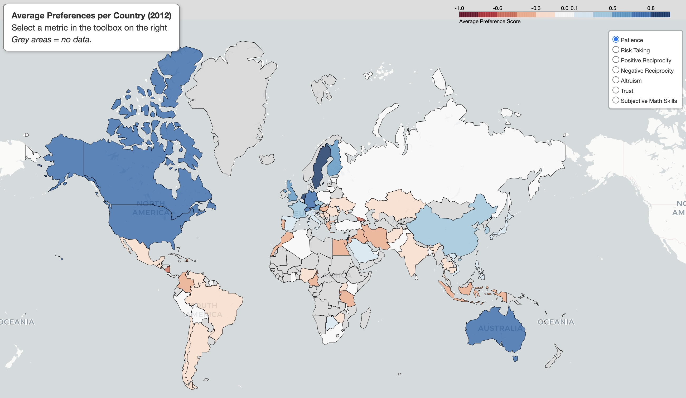

# Global Preferences Survey Analysis

A data science class project analyzing cross-cultural patterns in economic preferences across 76 countries using supervised & unsupervised machine learning and statistical methods.

## Overview

Analysis of the Global Preferences Survey dataset (80,337 individuals) exploring how patience, risk-taking, reciprocity, altruism, and trust vary globally.

**Dataset**: Further information can be found on the website (https://gps.iza.org/) and in the paper "Global Evidence on Economic Preferences" by Falk, Becker, Dohmen, Enke, Huffman, and Sunde, published in The Quarterly Journal of Economics* 133(4): 1645–1692, 2018 (https://doi.org/10.1093/qje/qjy013).

## Key Analyses

### Exploratory Data Analysis
- Weighted correlation analysis accounting for sampling weights
- Interactive world maps visualizing preference distributions by country
- Demographic patterns across age, gender, and continents

### Statistical Methods
- Eta coefficient analysis quantifying country/language effects (η² = 0.05-0.15)
- Point-biserial correlations for gender differences
- ANOVA testing cross-national variation

### Machine Learning

**Supervised Learning**
- Country prediction: XGBoost achieving 75% accuracy
- SHAP analysis showing language dominates in homogeneous countries, preferences matter in multilingual contexts
- Missing value imputation with XGBoost (R² = 0.30-0.40)

**Unsupervised Learning**
- PCA: 7 principal components explaining preference structure
- K-means clustering: 12 individual profiles, 7 country clusters

## Key Findings

- **Continental patterns**: Oceania highest in patience (0.67) and trust (0.30); Africa/South America higher risk-taking
- **Country explains 14.7% of patience variance** (large effect)
- **Strong country-level correlation** between altruism and positive reciprocity (r = 0.72)
- Age negatively correlates with risk-taking (-0.23); females show lower risk-taking (-0.11)

## Skills Demonstrated

- Advanced data cleaning and weighted statistical analysis
- Supervised/unsupervised machine learning
- Model interpretation with SHAP
- Interactive data visualization
- Cross-cultural data analysis

🌍 **Explore the interactive map of global preferences [here](https://luisadosch.github.io/global-preference-clustering-analysis/)!**

